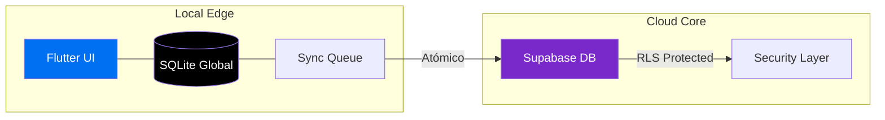

<div align="center">
  
  
  # BiPenc
  ### 💎 Sistema Experto de Inventario & POS (Offline-First)
  
  [](https://github.com/JhonatanSanchezIngSistemas/BiPenc)
  [](https://github.com/JhonatanSanchezIngSistemas/BiPenc)
  [](https://github.com/JhonatanSanchezIngSistemas/BiPenc)
  
  ---
  
  **BiPenc** no es solo un POS; es el núcleo operativo para negocios que no pueden permitirse detenerse. Diseñado con una arquitectura de **continuidad absoluta**, garantiza que cada venta y cada producto estén seguros, incluso en el corazón de la falta de conectividad.
  
</div>

---

## ✨ Características Premium

### 🏢 Continuidad "Offline-First"
Operación total sin internet. Sincronización inteligente en segundo plano mediante **Sync Queue V2**. Nunca pierdas una venta por problemas de red.

### 🛡️ Seguridad de Datos de Grado Bancario
- **Cifrado PII**: Nombres y direcciones protegidos bajo **AES-256-CBC**.
- **Blind Indexing**: Búsqueda ultrarrápida de DNI/RUC mediante **HMAC-SHA256** sin exponer datos sensibles.
- **Secure Storage**: Llaves maestras resguardadas en el hardware (Keystore/Keychain).

### 🖨️ Ecosistema Térmico Avanzado
Soporte nativo para impresoras **PT-210**. Algoritmo de **Dithering** propietario para logos nítidos y tickets profesionales optimizados para 58mm/80mm.

### 📸 Visión Artificial (ML Kit)
Detección inteligente de bordes, corrección de perspectiva y binarización adaptativa para la captura de listas de útiles y documentos físicos.

---

## 🏗️ Arquitectura de Élite



---

## 📂 Estructura del Proyecto

Organizado bajo principios de **Clean Architecture** para mantenimiento a largo plazo:

- `lib/modulos/`: Dominios funcionales (Caja, Inventario, Pedidos).
- `lib/servicios/`: Motores core (Impresión, Sincronización, OCR).
- `lib/datos/`: Modelos atómicos y lógica de negocio.
- `lib/base/`: Temas y configuraciones globales estandarizadas.

---

## 🚀 Guía de Inicio Rápido

### Requisitos
- Flutter SDK `^3.5.0`
- Android Studio / VS Code
- Archivo `.env` configurado (Ver `.env.example`)

### Instalación
```bash
# 1. Clonar repositorio
git clone https://github.com/JhonatanSanchezIngSistemas/BiPenc.git

# 2. Instalar dependencias
flutter pub get

# 3. Iniciar en modo producción
flutter run --release
```

---

<div align="center">
  <sub>Desarrollado con ❤️ por <b>Jhonatan Sanchez</b> - Arquitecto de Software & Ing. de Sistemas</sub><br/>
  <sub><b>Versión:</b> 1.0.1+2 | <b>Sincronización:</b> 28 de Marzo, 2026</sub>
</div>
